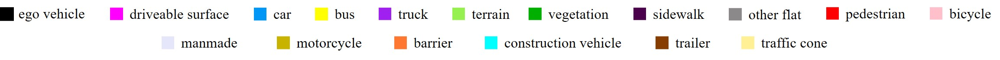
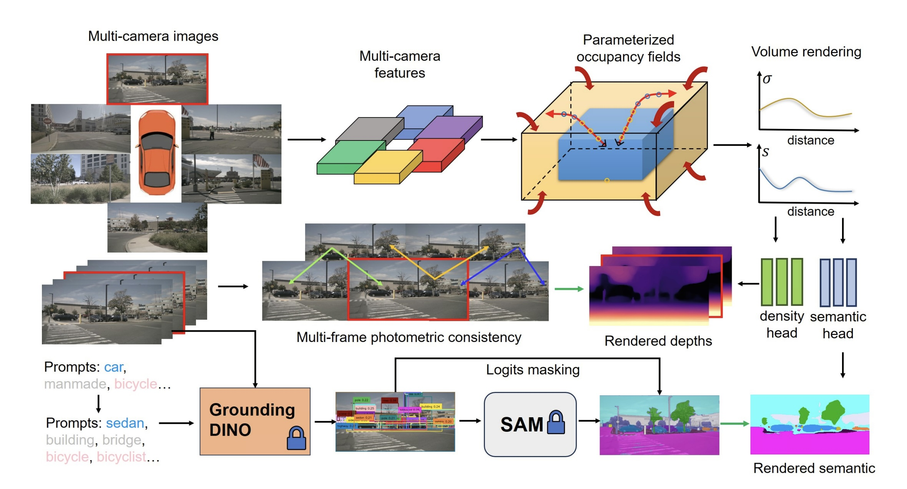

# OccNeRF

**[Project Page](https://linshan-bin.github.io/OccNeRF/) | [Paper](https://arxiv.org/pdf/2312.09243.pdf) | [Data](https://cloud.tsinghua.edu.cn/d/564c9ac19b5f4b54a774/)**

> OccNeRF: Advancing 3D Occupancy Prediction in LiDAR-Free Environments
>
> Chubin Zhang*, Juncheng Yan* [Yi Wei*](https://weiyithu.github.io/), [Jiaxin Li](https://www.jiaxinli.me/), Li Liu, [Yansong Tang](https://andytang15.github.io/), [Yueqi Duan](https://duanyueqi.github.io/), [Jiwen Lu](http://ivg.au.tsinghua.edu.cn/Jiwen_Lu/)

**Updates:**

- `🔔 2023/12/17` Generated 2D semantic labels release.
- `🔔 2023/12/15` Initial code and paper release.

## 🕹 Demos

Demos are a little bit large; please wait a moment to load them. If you cannot load them or feel them blurry, you can click the hyperlink of each demo for the full-resolution raw video.

### [Depth estimation:](https://cloud.tsinghua.edu.cn/d/564c9ac19b5f4b54a774/files/?p=%2Fdemos%2Foccnerf-demo.mp4)

<p align='center'>

</p>

### [Occupancy prediction:](https://cloud.tsinghua.edu.cn/d/564c9ac19b5f4b54a774/files/?p=%2Fdemos%2Foccnerf-demo-sem.mp4)

<p align='center'>


</p>

## 📝 Introduction

In this paper, we propose an OccNeRF method for self-supervised multi-camera occupancy prediction. Different from bounded 3D occupancy labels, we need to consider unbounded scenes with raw image supervision. To solve the issue, we parameterize the reconstructed occupancy fields and reorganize the sampling strategy. The neural rendering is adopted to convert occupancy fields to multi-camera depth maps, supervised by multi-frame photometric consistency. Moreover, for semantic occupancy prediction, we design several strategies to polish the prompts and filter the outputs of a pretrained open-vocabulary 2D segmentation model.

## 💡 Method

Method Pipeline:

<p align='center'>

</p>

We first use a 2D backbone to extract multi-camera features, which are lifted to 3D space to get volume features with interpolation. The parameterized occupancy fields are reconstructed to describe unbounded scenes. To obtain the rendered depth and semantic maps, we perform volume rendering with our reorganized sampling strategy. The multi-frame depths are supervised by photometric loss. For semantic prediction, we adopted pretrained Grounded-SAM with prompts cleaning. The green arrow indicates supervision signals.

## 🔧 Installation

Clone this repo and install the dependencies:

```bash
git clone --recurse-submodules https://github.com/LinShan-Bin/OccNeRF.git
cd OccNeRF
conda create -n occnerf python=3.8
conda activate occnerf
conda install pytorch==1.9.1 torchvision==0.10.1 cudatoolkit=11.3 -c pytorch -c conda-forge
pip install -r requirements.txt
```

Our code is tested with Python 3.8, PyTorch 1.9.1 and CUDA 11.3 and can be adapted to other versions of PyTorch and CUDA with minor modifications.

## 🏗 Dataset Preparation

1. Download nuScenes V1.0 full dataset data from [nuScenes](https://www.nuscenes.org/nuscenes#download) and link the data folder to `./data/nuscenes/nuscenes/`.

2. Download the ground truth occupancy labels from [Occ3d](https://tsinghua-mars-lab.github.io/Occ3D/) and unzip the `gts.tar.gz` to `./data/nuscenes/gts`. Note that we only use the 3d occupancy labels for validation.

3. Generate the ground truth depth maps for validation:

      ```bash
      python tools/export_gt_depth_nusc.py
      ```

4. Download the generated 2D semantic labels from [semantic_labels](https://cloud.tsinghua.edu.cn/d/564c9ac19b5f4b54a774/?p=%2Fsemantic_labels&mode=list) and extract the data to `./data/nuscenes/`. We recommend that you use `pigz` to speed up the process.

5. Download the pretrained weights of our model from [Checkpoints](https://cloud.tsinghua.edu.cn/d/564c9ac19b5f4b54a774/?p=%2Fckpts&mode=list) and move them to `./ckpts/`.

6. (Optional) If you want to generate the 2D semantic labels by yourself, please refer to the `README.md` in [GroundedSAM_OccNeRF](https://github.com/JunchengYan/GroundedSAM_OccNeRF). The  dataset index pickle file `nuscenes_infos_train.pkl` is from [SurroundOcc](https://cloud.tsinghua.edu.cn/d/8dcb547238144d08a0bb/) and should be placed under `./data/nuscenes/`.

The Final folder structure should be like:

```
OccNeRF/
├── ckpts/
│   ├── nusc-depth/
│   │   ├── encoder.pth
│   │   ├── depth.pth
│   ├── nusc-sem/
│   │   ├── encoder.pth
│   │   ├── depth.pth
├── data/
│   ├── nuscenes/
│   │   ├── nuscenes/
│   │   │   ├── maps/
│   │   │   ├── samples/
│   │   │   ├── sweeps/
│   │   │   ├── v1.0-trainval/
│   │   ├── gts/
│   │   ├── nuscenes_depth/
│   │   ├── nuscenes_semantic/
│   │   ├── nuscenes_infos_train.pkl
├── ...
```

## 🚀 Quick Start

### Training

Train OccNeRF without semantic supervision:

```bash
python -m torch.distributed.launch --nproc_per_node=8 run.py --config configs/nusc-depth.txt
```

_In order to train the full model, you need at least 80 GB GPU memory. If you have less GPU memory (e.g., 40 GB), you can train with a single frame (set `auxiliary_frame = False` in the config file). See section 4.4 in the paper for the ablation study. Evaluation can be done with 24 GB GPU memory._

Train OccNeRF with semantic supervision:

```bash
python -m torch.distributed.launch --nproc_per_node=8 run.py --config configs/nusc-sem.txt
```

### Evaluation

Evaluate the depth estimation:

```bash
python -m torch.distributed.launch --nproc_per_node=8 run.py --config configs/nusc-depth.txt --eval_only --load_weights_folder ckpts/nusc-depth
```

Evaluate the occupancy prediction:

```bash
python -m torch.distributed.launch --nproc_per_node=8 run.py --config configs/nusc-sem.txt --eval_only --load_weights_folder ckpts/nusc-sem
```

### Visualization

Visualize the depth estimation:

```bash
python tools/export_vis_data.py  # You can modify this file to choose scenes you want to visualize. Otherwise, all validation scenes will be visualized.
python -m torch.distributed.launch --nproc_per_node=8 run_vis.py --config configs/nusc-depth.txt --load_weights_folder ckpts/nusc-depth --log_dir your_log_dir
python gen_scene_video.py scene_folder_generated_by_the_above_command
```

Visualize the semantic occupancy prediction:

```bash
python tools/export_vis_data.py  # You can modify this file to choose scenes you want to visualize. Otherwise, all validation scenes will be visualized.
python -m torch.distributed.launch --nproc_per_node=8 run_vis.py --config configs/nusc-sem.txt --load_weights_folder ckpts/nusc-sem --log_dir your_log_dir
python gen_scene_video.py scene_folder_generated_by_the_above_command --sem_only
```

## 🙏 Acknowledgement

Many thanks to these excellent projects:

- [SimpleOccupancy](https://github.com/GANWANSHUI/SimpleOccupancy)
- [SurroundDepth](https://github.com/weiyithu/SurroundDepth)
- [RenderOcc](https://github.com/pmj110119/RenderOcc)
- [SurroundOcc](https://github.com/weiyithu/SurroundOcc)
- [Occ3D](https://github.com/Tsinghua-MARS-Lab/Occ3D)

## 📃 Bibtex

If this work is helpful for your research, please consider citing the following BibTeX entry.

```bibtex
@article{chubin2023occnerf, 
      title   = {OccNeRF: Advancing 3D Occupancy Prediction in LiDAR-Free Environments}, 
      author  = {Chubin Zhang and Juncheng Yan and Yi Wei and Jiaxin Li and Li Liu and Yansong Tang and Yueqi Duan and Jiwen Lu},
      journal = {arXiv preprint arXiv:2312.09243},
      year    = {2023}
}
```
